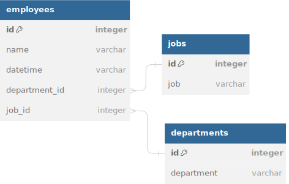

# globant-task

#### DB Diagram:



#### Application Architecture:


run with Docker:

```bash
docker compose up -d
```

API Available at:

```agsl
http://localhost:8080/docs#/
OR
http://localhost:8080/redoc
```

Scale the worker instances:

```bash
docker compose up -d --scale worker=3
```

Monitor the logs:

```agsl
http://localhost:5555/dashboard
```

Send jobs to the API:

```bash
curl -X 'POST' \
  'http://localhost:8080/api/jobs/file/' \
  -H 'accept: application/json' \
  -H 'Content-Type: multipart/form-data' \
  -F 'file=@jobs.csv;type=text/csv'
```

Send departments to the API:

```bash
curl -X 'POST' \
  'http://localhost:8080/api/departments/file/' \
  -H 'accept: application/json' \
  -H 'Content-Type: multipart/form-data' \
  -F 'file=@departments.csv;type=text/csv'
```

Send employees to the API:

```bash
curl -X 'POST' \
  'http://localhost:8080/api/employees/file/' \
  -H 'accept: application/json' \
  -H 'Content-Type: multipart/form-data' \
  -F 'file=@employees.csv;type=text/csv'
```

Get all jobs:

```bash
curl -X 'GET' \
  'http://localhost:8080/api/jobs/' \
  -H 'accept: application/json'
```

Get all departments:

```bash
curl -X 'GET' \
  'http://localhost:8080/api/departments/' \
  -H 'accept: application/json'
```

Get all employees:

```bash
curl -X 'GET' \
  'http://localhost:8080/api/employees/' \
  -H 'accept: application/json'
```

Post new Job:

```bash
curl -X 'POST' \
  'http://localhost:8080/api/jobs/job' \
  -H 'accept: application/json' \
  -H 'Content-Type: application/json' \
  -d '{
  "id": 0,
  "job": "Test Job"
}'
```

Post new Department:

```bash
curl -X 'POST' \
  'http://localhost:8080/api/departments/department' \
  -H 'accept: application/json' \
  -H 'Content-Type: application/json' \
  -d '{
  "id": 0,
  "department": "Test Department
}'
```

post new Employee:

```bash
curl -X 'POST' \
  'http://localhost:8080/api/employees/employee' \
  -H 'accept: application/json' \
  -H 'Content-Type: application/json' \
  -d '{
  "id": 0,
  "name": "Test Employee",
  "datetime": "2021-01-01T00:00:00.000Z",
  "job_id": 0,
  "department_id": 0
  }'
```

Get analytics of employees by quarter by year 2021:

```bash
curl -X 'POST' \
  'http://localhost:8080/api/analytics/post_employee_hires_by_quarter?year=2021' \
  -H 'accept: application/json' \
  -d ''
```

Get analytics of department with above average hires by year 2021:

```bash
curl -X 'POST' \
'http://localhost:8080/api/analytics/post_departments_with_above_average_hires?year=2021' \
-H 'accept: application/json' \
-d ''
```

Get task result by task_id (eg. 284349de-cd16-4168-8a17-4fa66d2f1f5c):

```bash
curl -X 'GET' \
  'http://localhost:8080/api/result/results/?task_id=284349de-cd16-4168-8a17-4fa66d2f1f5c' \
  -H 'accept: application/json'
```

Run load test:

```bash
locust -f load_testing.py --spawn-rate 1 --users 3 --host http://localhost:8080 --autostart 
```